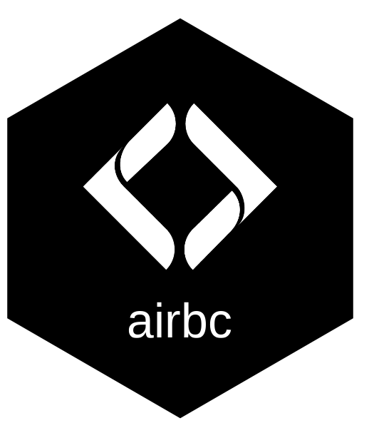

# airbc 

BC Historic Airphoto Explorer — interactive Shiny app for browsing historic orthophoto imagery from the [BC Data Catalogue](https://catalogue.data.gov.bc.ca/dataset/airphoto-centroids).

Filter by year, media type, and scale. View estimated photo footprints on the map. Export your selection to CSV or Excel.

## Quick Start

```r
# 1. Install dependencies
install.packages(c(
  "shiny", "bslib", "leaflet", "leaflet.extras", "sf", "DT",
  "dplyr", "stringr", "purrr", "fs", "fwapgr", "bcdata", "janitor"
))

# 2. Cache data layers (one-time download, ~5 min)
source("scripts/cache_data.R")

# 3. Launch the app
shiny::runApp()
```

## Use It for Your Own Watershed

Open `scripts/cache_data.R` and change three parameters at the top:

```r
blk <- 360873822    # blue_line_key — unique ID for the river/stream
drm <- 166030.4     # downstream_route_measure — how far upstream (in metres) to start
buf <- 1500         # buffer around the watershed (metres)
```

Then re-run `source("scripts/cache_data.R")` and restart the app.

**How to find `blk` and `drm` for your watershed:**

1. Go to the [FWA Stream Network map](https://features.hillcrestgeo.ca/fwa/index.html)
2. Click on your stream — the popup shows `blue_line_key` and `downstream_route_measure`
3. Copy those values into `cache_data.R`

## Custom AOI (No Watershed Needed)

Instead of using the built-in watershed, switch to **Custom** mode in the app to:

- **Draw** a polygon directly on the map
- **Upload** a GeoJSON or GeoPackage file (e.g. a floodplain polygon from QGIS)

See `scripts/lateral_habitat_to_vector.R` for an example of generating a custom AOI from a raster.
