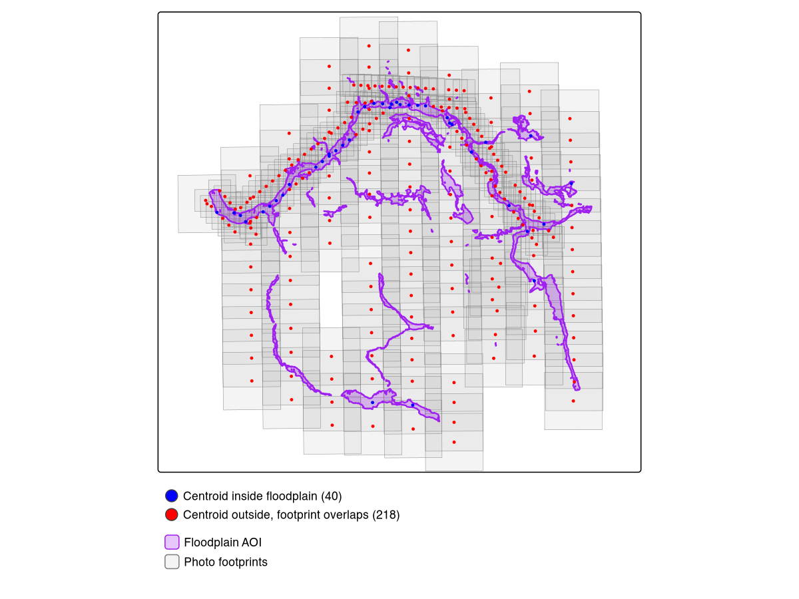
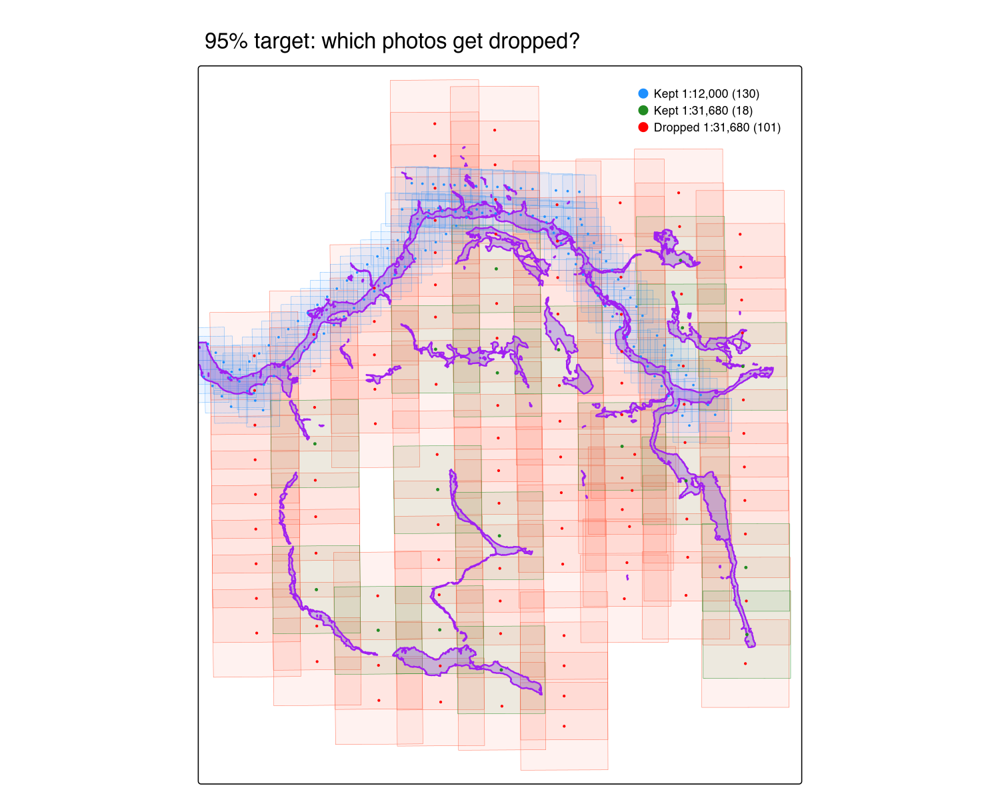
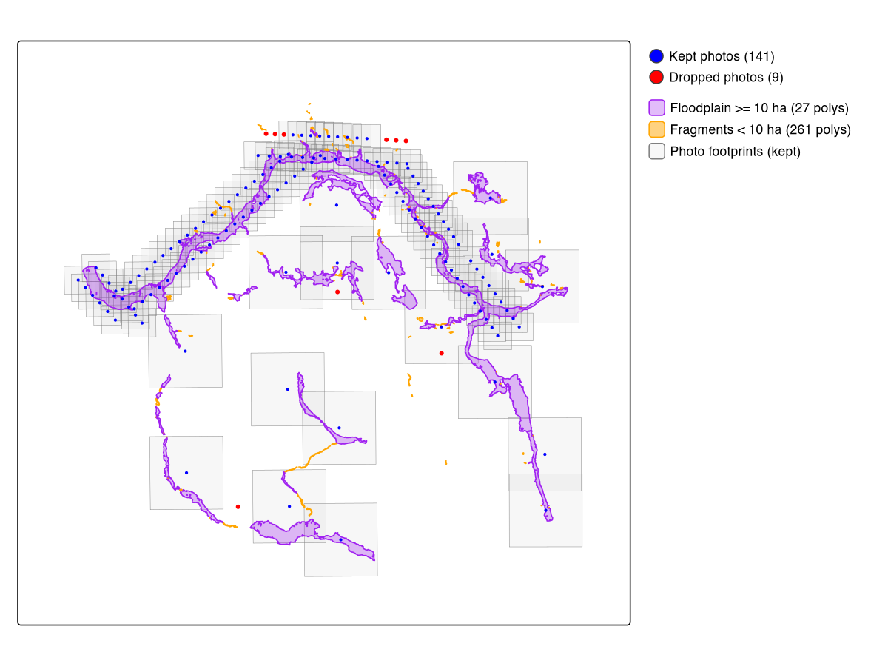

```{r setup, include = FALSE}
knitr::opts_chunk$set(
  collapse = TRUE,
  comment = "#>",
  eval = FALSE
)
```

This vignette walks through a real photo selection for the Neexdzii Kwah
(Upper Bulkley River) watershed in northwest BC. The goal: find every
available 1968 airphoto covering the modelled coho floodplain, so we can
understand what the riparian zone looked like before decades of land use
change. Was it rangeland? Old growth cottonwood forest? Wetland complex?
The airphotos are the ground truth.

## The two-tier AOI

diggs uses a two-tier area of interest:

1. **Watershed window** — configured in `data-raw/cache_data.R` before the app
   starts. This defines the regional extent: which photo centroids get downloaded
   from the BC Data Catalogue and cached locally. For Neexdzii Kwah, that's
   9,388 centroids spanning 1963--2019.

2. **Floodplain refinement** — a custom AOI uploaded or drawn inside the app.
   This narrows the selection to just the photos that cover your actual study
   area. Here, that's the 123.5 km^2^ coho floodplain delineated by
   [flooded](https://github.com/NewGraphEnvironment/flooded).

The watershed window is broad (you only run it once). The floodplain refinement
is precise (you iterate on it as your analysis evolves).

## Step 1: Delineate the floodplain

The floodplain AOI comes from [`flooded::fl_valley_confine()`](https://www.newgraphenvironment.com/flooded/reference/fl_valley_confine.html) — a valley
confinement algorithm that uses a DEM, slope raster, stream network, and
precipitation to model where water can spread laterally.

The script `data-raw/vignette_neexdzii.R` runs this pipeline:

```{r floodplain}
library(flooded)

# Query coho streams (order >= 4) from bcfishpass
conn <- DBI::dbConnect(RPostgres::Postgres(),
  host = "localhost", port = 63333,
  dbname = "bcfishpass", user = "newgraph"
)
streams <- sf::st_read(conn, query = sql) |> sf::st_zm(drop = TRUE)
# 1,165 segments across 20 named streams

# Rasterize precipitation (mean annual precip from upstream area)
precip_r <- fl_stream_rasterize(streams, dem, field = "map_upstream")

# Run VCA
valleys <- fl_valley_confine(
  dem, streams,
  field = "upstream_area_ha",
  slope = slope,
  slope_threshold = 9,
  max_width = 2000,
  cost_threshold = 2500,
  flood_factor = 6,
  precip = precip_r,
  size_threshold = 5000,
  hole_threshold = 2500
)

# Polygonize and save as GeoJSON for diggs
valleys_poly <- fl_valley_poly(valleys)
sf::st_write(sf::st_transform(valleys_poly, 4326),
  "data/floodplain_neexdzii_co_4th_order.geojson"
)
```

This produces a single polygon covering 123.5 km^2^ of modelled floodplain
along 4th+ order coho streams.

## Step 2: Cache the watershed data

Before launching diggs, run `data-raw/cache_data.R` to download reference
layers and photo centroids from the BC Data Catalogue. The script is
parameterized by `blk` (blue line key) and `drm` (downstream route measure):

```{r cache}
# In data-raw/cache_data.R:
blk <- 360873822    # Bulkley River
drm <- 166030.4     # Neexdzii Kwa / Wedzin Kwa confluence

source("data-raw/cache_data.R")
# Caches 9,388 photo centroids (1963-2019), streams, railways, NTS grid
```

## Why footprint filtering matters

Floodplains are narrow linear features. A photo centroid can land outside the
floodplain while the actual photo coverage — the footprint — extends across it.
This is the difference between [`fly_filter(method = "centroid")`](https://www.newgraphenvironment.com/fly/reference/fly_filter.html) and
[`fly_filter(method = "footprint")`](https://www.newgraphenvironment.com/fly/reference/fly_filter.html):

| Method | 1968 photos found | What it checks |
|--------|-------------------|----------------|
| Centroid | 40 | Centre point falls inside AOI |
| Footprint | 258 | Estimated photo rectangle overlaps AOI |

**Centroid filtering misses 85% of the useful photos.** The 218 "extra" photos
have centres outside the floodplain but their coverage extends across it —
exactly the photos you need for edge-to-edge coverage of a narrow valley bottom.

The map below shows this visually. Blue dots are centroids that land inside the
floodplain. Red dots are centroids outside it whose footprints (grey rectangles)
still overlap. The purple polygon is the modelled floodplain.

```{r footprint-map, eval=TRUE, echo=FALSE, out.width="100%", fig.cap="Blue: centroids inside floodplain (40). Red: centroids outside whose footprints overlap (218). Purple: modelled floodplain. Grey: estimated photo footprints."}

```

## Step 3: Launch diggs and select photos

```{r launch}
diggs::run_app()
```

In the app:

1. Switch AOI mode to **Custom (draw or upload)**
2. Upload `data/floodplain_neexdzii_co_4th_order.geojson`
3. Set **Filter Method** to **Footprint**
4. Set year range to **1968--1968**
5. Click **Select** to run resolution-prioritized selection
6. Click **Download CSV** to export

## Step 4: What we got

Footprint filtering finds **258 photos** whose coverage overlaps the floodplain
(vs just 40 by centroid — see above). The priority selection algorithm then
picks which of those 258 to actually order: all finest-scale photos first,
then backfilling remaining AOI gaps with coarser scales until the coverage
target is met.

At the default **95% coverage target**, the selection returns **148 photos**:

| Scale | Photos | Resolution |
|-------|--------|------------|
| 1:12,000 | 130 | High — individual trees visible |
| 1:31,680 | 18 | Medium — fills gaps between fine-scale coverage |

The 1:12,000 photos are the priority — at this scale you can identify cottonwood
stands, wetland boundaries, side channel morphology, and agricultural clearing
patterns. Only 18 coarse-scale photos are needed to reach 97.7% AOI coverage.

```{r results}
sel <- read.csv("data/photo_selection_neexdzii_1968.csv")
table(sel$scale)
# 1:12000 1:31680
#     130      18
```

## Why not 100% coverage?

The last few percent of coverage is expensive. Pushing from 95% to 100%
requires **101 additional coarse-scale photos** to fill tiny gaps between the
fine-scale footprints:

| Target | Photos | Coverage | 1:12,000 | 1:31,680 |
|--------|--------|----------|----------|----------|
| **95%** | **148** | **97.7%** | **130** | **18** |
| 100% | 249 | 100.0% | 130 | 119 |
| 90% | 144 | 94.3% | 130 | 14 |
| 85% | 142 | 91.8% | 130 | 12 |

The 130 priority 1:12,000 photos are the same at every target — only the
coarse-scale backfill changes. At 100%, you need 119 coarse photos; at 95%,
just 18. All 101 dropped photos are 1:31,680 — the fine-scale set is
completely untouched. The 2.3% of uncovered AOI consists of thin slivers
between fine-scale footprints that are unlikely to contain information not
already captured by adjacent photos.

```{r coverage-map, eval=TRUE, echo=FALSE, out.width="100%", fig.cap="Blue: kept 1:12,000 photos (130). Green: kept 1:31,680 photos (18). Red: dropped 1:31,680 photos (101). Purple: modelled floodplain. All dropped photos are coarse-scale — the fine-scale set is untouched."}

```

diggs defaults to 95% for this reason. You can adjust the slider in the app
to trade off between completeness and cost.

## Pruning floodplain fragments

The VCA produces 288 polygon fragments, but most are tiny artifacts on upper
tributaries — 214 are under 1 ha. These isolated pockets on streams like Foxy
Creek and upper Crow Creek expand the analysis extent for negligible floodplain
area. Combined with the 95% coverage target, dropping fragments under 10 ha
removes 261 of 288 polygons while only reducing the selection from 148 to 141:

| Min area filter | Polygons kept | Photos (95%) | Dropped |
|----------------|---------------|--------------|---------|
| None (raw) | 288 | 148 | — |
| >= 1 ha | 74 | 144 | 4 |
| >= 5 ha | 45 | 142 | 6 |
| >= 10 ha | 27 | 141 | 7 |
| >= 50 ha | 15 | 139 | 9 |

The 95% target already handles most edge trimming — fragment pruning
complements it but doesn't stack dramatically. The dropped photos all land on
the periphery; the core riverscape coverage stays intact.

```{r pruned-map, eval=TRUE, echo=FALSE, out.width="100%", fig.cap="At 95% coverage target: purple = floodplain >= 10 ha (27 polys), orange = fragments < 10 ha (261 polys), blue = kept photos (141), red = dropped photos (9), grey = footprints for kept set."}

```

This pruning is a stopgap — a simple area threshold doesn't account for network
position. A fragment between two large floodplain polygons should be kept
regardless of size, while an isolated pocket on upper Foxy Creek should be
dropped even if it's 15 ha. Network-aware pruning is planned for
[fresh](https://github.com/NewGraphEnvironment/sred-2025-2026/issues/18)
(FWA-Referenced Spatial Hydrology), which will snap polygons to the stream
network and prune based on connectivity rather than area alone.

## What comes next

Order the photos from the
[BC Air Photo Warehouse](https://www2.gov.bc.ca/gov/content/data/geographic-data-services/air-photos),
scan or georeference them, then compare against modern satellite imagery
from [drift](https://github.com/NewGraphEnvironment/drift) to quantify
land cover change within the floodplain. The combination answers: what
changed, where, and when — the foundation for restoration prioritization.

## Ecosystem

| Package | Role in this workflow |
|---------|---------------------|
| [flooded](https://github.com/NewGraphEnvironment/flooded) | Delineated the floodplain AOI |
| [fly](https://github.com/NewGraphEnvironment/fly) | Computed footprints and ran coverage selection |
| **diggs** | Interactive exploration and export |
| [drift](https://github.com/NewGraphEnvironment/drift) | Next step — satellite land cover change analysis |
